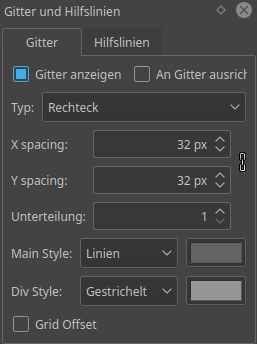
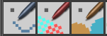

# Anleitung zur Bearbeitung von Workadventure-Karten

## Benötigte Software

* [Tiled](https://www.mapeditor.org/) zur Bearbeitung der Karte
* [Krita](https://krita.org/en/) zur Bearbeitung von Kacheln

## Neue Kacheln erzeugen

Um neue Kacheln zu erzeugen, insbesondere neue Dateien mit Kacheln, gibt es
zwei Methoden

### Die einfache Methode

Mit Krita wird eine bestehende Kachelsammlung geöffnet (z.B.:
`zw-map/tiles/zw.kra`) und fügt entweder in dieser Datei neue Ebenen mit neuen
Kacheln hinzu oder man entledigt sich aller Ebenen und speichert es als neue
Datei ab.

### Die schwierigere methode

Krita wird geöffnet und es wird eine neue Datei erzeugt. Die Größe kann in
beliebigen Vielfachen von 32 Pixeln angegeben werden. Die Voreinstellungen für
Texturen bieten eine gute Grundlage.

## Einblenden von Hilfslinien

Um die Kachelgröße einzelner Kacheln als Gitter von Hilfslinien angezeigt zu
bekommen, wählt man im Menü "Einstellungen" das Untermenü "Andockbare Dialoge"
und aktiviert daraus den Eintrag "Gitter und Hilfslinien".

In dem nun erscheinendem Dock gibt man als Gitterhöhe und -Breite 32 Pixel ein.

## Zeichnen von Kacheln

Nun kann man mit dem Pinselwerkzeug (Taste: `B`) munter auf den Ebenen malen.

Als Werkzeugspitzen eignen sich am Besten die drei, die für Pixelart optimiert
sind:

